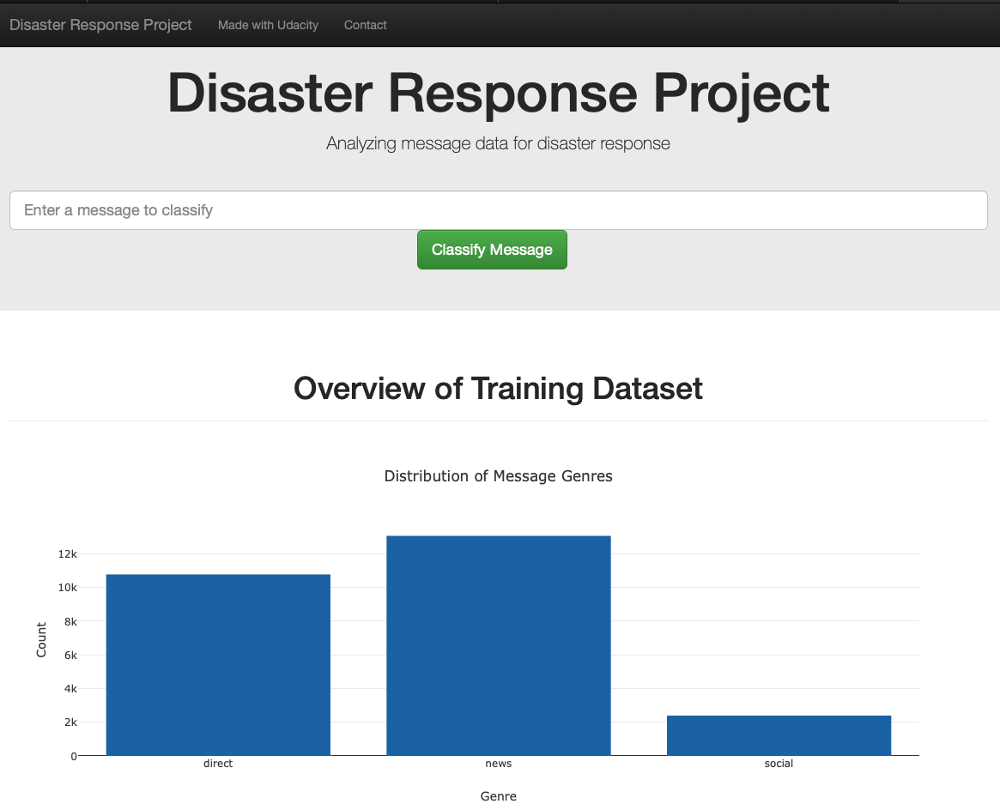
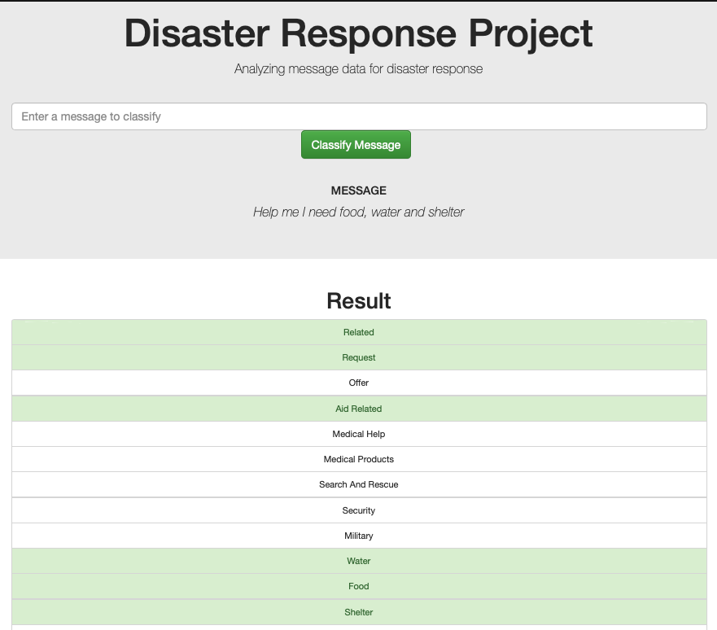

## Disaster Response Pipeline
##### by Markus Müller

### Motivation
This project is part of the Udacity Data Scientist Nanodegree. The first goal is to implement a ETL pipeline to extract text data from disaster response messages (<a href='https://appen.com/datasets/combined-disaster-response-data/'>Link to dataset</a>), transform the date and load it into a SQL database. After the ETL piple is established the data is used in a ML pipeline that trains a ML algorithm to classify messages into their category. This classifier is than used to create a Web app (Flask) wich gives general informations about the disaster messages and classifies new ones, that a user can input.

### Files
The different steps of this project are split across three folders:
- data (containing the ETL pipeline and the datasets)
  - categories.csv (dataset with the categories for each message)
  - messages.csv (dataset with the messages)
  - DisasterResponse.db (sql database with the results from the ETL pipeline )
  - process_data.py (ETL pipeline)
- models 
  - train_classifier.py (ML pipeline)
  - classifier.pkl (saved ML model)
- app
  - run.py (script that runs the Flask web app)
  - templates

### How to run
You can directly run the flask web app with the following command (make sure you set 'app' as your working directory):
```
python run.py
```
and than go to to http://0.0.0.0:3001/

IF you want to make some adjustments in the ETL process or change the ML alogorithm than you need to run these commands first before launching the flask web app
Run ETL Pipeline with:
```
python ./data/process_data.py ./data/messages.csv ./data/categories.csv ./data/DisasterResponse.db
```
Run ML Pipeline with:
```
python ./models/train_classifier.py ./data/DisasterResponse.db ./data/classifier.pkl
```

### Cleaning steps
- joining messages and categories datasets
- create columns for each individual category
- removed `child_alone` category since ther were only zeros -> no value for the classification
- replaced twos with ones in the `related` category

### Modeling process
- tested RandomForestClassifier as part of MultiOutputClassifier with Gridserach:
  - n_estimators: [50, 100] 
  - min_samples_split: [2, 4],
  - criterion: ['entropy', 'gini']
- tested LogisticRegression as part of MultiOutputClassifier with Gridserach:
  - C: [0.01, 0.1, 1, 10, 100]
  - solver: ['saga', 'lbfgs']
LogisticRegression with C=10 and solver='saga' produced the highest scores and was therefore used as the classifier.

### Libraries
- numpy
- pandas
- sklearn
- nltk

### Limitations
As you see in the screenshots of the web app the categories are very unequal in terms of thier frequencies in the messages. This baised the classifier, because it learns not to assign rare categories since it trys to minimize misclassifications. A possible solution is to implement sufficient upsempling techniques to make the rare categories more frequent. But this is beyond the scope of the project. 

### Screenshots





