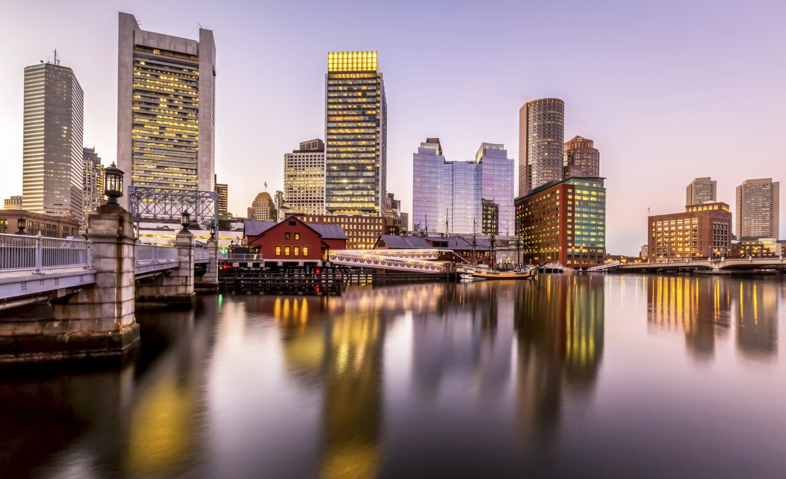

## Write A Data Science Blog Post
##### by Markus Müller

This notebook is a deliverable for the Udacity Data Scientist Nanodegree and is the basis for the blog post published on <a href='https://medium.com/@markusmller_92879/so-you-want-to-travel-to-boston-and-take-an-airbnb-here-is-what-you-need-to-know-5fb1d53961a2'>Medium</a>.

Data used for this analysis:Boston Airbnb Open Data from <a href='https://www.kaggle.com/airbnb/boston'>Kaggle</a>

### Libraries
- numpy
- pandas
- matplotlib
- seaborn
- plotly
- chart_studio
- sklearn

### Files
- Data_Analysis_Blog_Post.ipynb: Notebook with the code
- visualization.html: an html file with the interactive plotly visualization
- boston.jpg: picture of Boston used in the blog post

### Structure of analyzed Data
- listings: full description of the listing
- calendar: shows the availability of each listing for each day and a correspoonding price, when the listing is available 

### cleaning steps
- transformed columns with price to make them usable
- transformed date columns to a DateTimeObject
- removed outliers in the price column

### General Results
- as more BnBs became available the mean price reduced to around $180 to $200 from its global high at $280
- the mean prices increases on Friday and Sturday
- the most expensive neighbourhoods are Bay Village, the Leather District and South Boston Waterfront, which are up to $75-$100 more expensive than the mean price.
- the cheapest neighborhoods are Mattapan, Hypde Park and Dorcheste, which are around §75 cheaper than the mean price 
- neighbourhood has the higest impact on price, followed by room type,number of bedrooms and anemities. Interestingly reveiw score hadn't any impact on price.
- some essential amenities like internet access, lock on bedroom door or hangers, decraese the price of a BnB. 
- doorman and fireplace increase the price with around $20
- most nice to have amenities won't set you back much (around $5)

### Data preparation for the linear regression
- filled missing values of possible predictors with different methods (mode, mean and random sample method)
- identified relevnat columns which could predict price with a correlation matrix for numerical variables and boxplots for categorical values
- transformed categorical variables to dummy variables with (k-1) to avoide multicollinearity

### Data Modeling
- Linear Regression
- final predictors: neighbourhood, bathrooms, bedromms, guests_included, property_type, cancalation_policy, room_type, bed_type and amenities
- to predict price of AirBnB in Boston

### Linear Model
- Performace Measures:
  - MAE: 41.75
  - MSE: 3643.40
  - RMSE: 60.36
  - r_squared: 0.64

### Resources
- https://matplotlib.org/gallery/api/two_scales.html
- https://plotly.com/python/mapbox-layers/
- https://medium.com/analytics-vidhya/plotly-for-geomaps-bb75d1de189f
- https://towardsdatascience.com/how-to-create-a-plotly-visualization-and-embed-it-on-websites-517c1a78568b
- https://towardsdatascience.com/8-clutch-ways-to-impute-missing-data-690481c6cb2b
- https://stackoverflow.com/questions/36413314/filling-missing-data-by-random-choosing-from-non-missing-values-in-pandas-datafr
